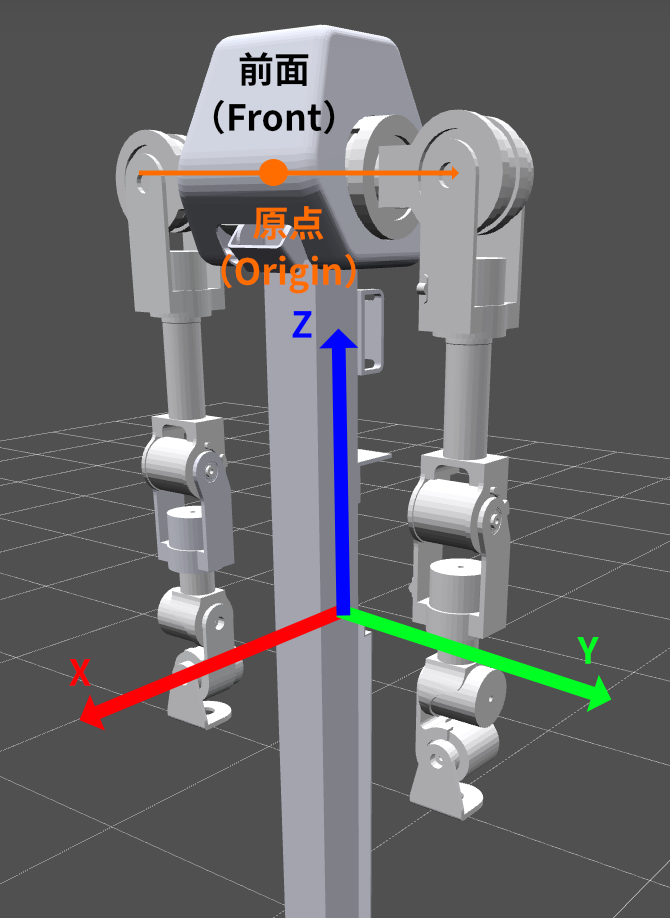
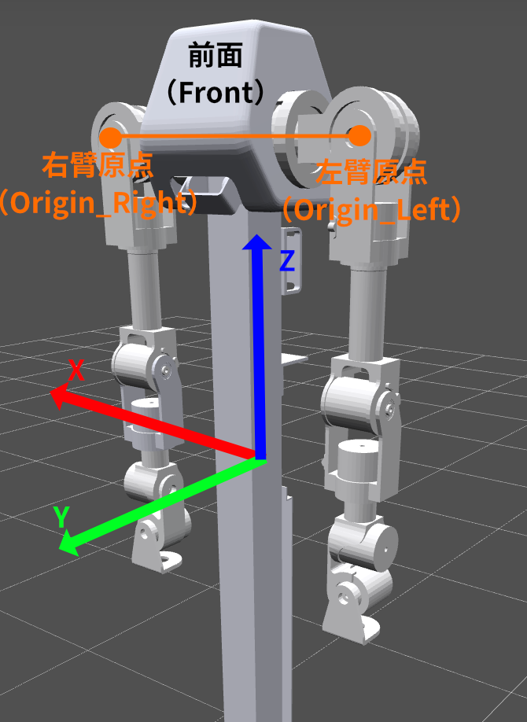

# P7 机械臂

P7 是一款 7 自由度机械臂。同一 CAN 总线上混合使用两种电机协议：

- **关节 0–4**：`A7Motor`（V1，CMD 字节协议，驱动端梯形轨迹规划）
- **关节 5–6**：`MotorV2`（V2 / Motorevo，打包帧协议，力位混合 P-T-M 模式；驱动端无轨迹生成器）

因此 `move_j` / `move_l` 由主机以约 100 Hz 流式下发插值路点，使两类电机同步跟踪。

## 快速开始

```python
from linkerbot import P7

with P7(
    side="left",
    interface_name="can0",
) as arm:
    arm.enable()  # 使能机械臂所有 7 个关节电机
    arm.home()  # 将机械臂移动到零位
    arm.disable()  # 失能机械臂所有 7 个关节电机
```

### 构造参数

| 参数             | 类型                    | 默认值            | 说明                    |
| ---------------- | ----------------------- | ----------------- | ----------------------- |
| `side`           | `"left"` \| `"right"`   | 必填              | 左臂或右臂              |
| `interface_name` | `str`                   | 必填              | CAN 接口名，如 `"can0"` |
| `interface_type` | `str`                   | `"socketcan"`     | CAN 接口类型            |
| `tcp_offset`     | `list[float]`           | `[0.0, 0.0, 0.0]` | TCP 偏移量              |
| `world_frame`    | `"urdf"` \| `"maestro"` | `"urdf"`          | 世界坐标系约定          |

构造时会自动检查所有 7 个电机是否在线，并对关节 5–6 幂等写入 Flash Control Mode `0x02`（P-T-M）。

CAN ID：左臂 `61–67`，右臂 `51–57`（与关节顺序 L1..L7 / R1..R7 对应）。

**前置依赖：** P7 依赖 Pinocchio 进行运动学计算，需要安装 `kinetix` 可选依赖：

```bash
pip install linkerbot[kinetix]
```

> **Windows 用户**：Pinocchio 不支持 pip 安装，请使用 `conda install pinocchio -c conda-forge`。

**异常：**

- `ImportError`: 未安装 `kinetix` 可选依赖（Pinocchio）
- `ValueError`: `side` 或 `world_frame` 参数非法
- `StateError`: 电机未响应 CAN 总线 / 初始数据读取失败

> **URDF 文件路径**：`src/linkerbot/arm/kinetix/urdf/p7__left.urdf` 和 `p7__right.urdf`

**实机示例：** `examples/p7_enable_small_move.py`、`examples/p7_detect.sh`

## 坐标系说明

P7 支持两种世界坐标系，通过 `world_frame` 参数选择。

### URDF 坐标系（默认）

URDF 模型文件的坐标系，原点位于机器人左右臂肩关节连线中点处，如图所示：

<p align="center">
  
</p>

- **X 轴**：机器人背后指向机器人前方为 X 轴正方向
- **Y 轴**：机器人视角左手边（面对机器人站立右手边）为 Y 轴正方向
- **Z 轴**：由右手定则确定上方为 Z 轴正方向
- **Rx, Ry, Rz**：表示按照 Z,Y,X 轴顺序，逆时针为正进行旋转

### Maestro 坐标系

Maestro 坐标系，相对 URDF 坐标系进行了两步变换，如图所示：

<p align="center">
  
</p>

1. **原点平移**：将世界坐标原点从基座中心平移到 Joint 2（肩部第二关节）中心处
2. **Z 轴旋转 90°**：在新原点将 URDF 坐标轴绕 Z 轴逆时针旋转 +90°

变换后：

- **X 轴**：机器人视角右手边（面对机器人站立左手边）为 X 轴正方向
- **Y 轴**：机器人背后指向机器人前方，为 Y 轴正方向
- **Z 轴**：由右手定则确定上方为 Z 轴正方向

> **注意**：这两种坐标的定义方式主要影响 `move_p` 和 `move_l` 涉及到 `Pose` 的部分，不影响 `move_j` 控制。

## 关节定义

### 零位定义

所有关节角度为 `[0.0, 0.0, 0.0, 0.0, 0.0, 0.0, 0.0]` 时，机械臂应当处于“自然下垂”姿态（关节相互垂直）；调用 `home()` 可回到零位。

### 角度正方向定义

角度正方向遵从**右手定则**：以右手拇指指向旋转轴正方向，四指弯曲方向为正角度增大方向。

- **轴为 `0 1 0`（Y 轴正方向）**：角度增大时，从正 Y 轴看为逆时针旋转
- **轴为 `1 0 0`（X 轴正方向）**：角度增大时，从正 X 轴看为逆时针旋转
- **轴为 `0 0 -1`（Z 轴负方向）**：角度增大时，从上方看为顺时针旋转
- **轴为 `0 -1 0`（Y 轴负方向）**：角度增大时，从正 Y 轴看为顺时针旋转

### P7 左臂关节一览（URDF 坐标系）

| 索引 | 关节名称 | 物理含义             | 旋转轴（URDF）         | 角度范围（rad） | 电机 |
| ---- | -------- | -------------------- | ---------------------- | --------------- | ---- |
| 0    | L1_Joint | 肩部俯仰             | Y 轴正方向（`0 1 0`）  | [-2.91, 2.91]   | V1   |
| 1    | L2_Joint | 肩部横滚             | X 轴正方向（`1 0 0`）  | [-0.07, 3.2]    | V1   |
| 2    | L3_Joint | 肩部偏转（上臂扭转） | Z 轴负方向（`0 0 -1`） | [-2.69, 2.69]   | V1   |
| 3    | L4_Joint | 肘部俯仰             | Y 轴正方向（`0 1 0`）  | [-2.05, 2.05]   | V1   |
| 4    | L5_Joint | 肘部偏转（前臂扭转） | Z 轴负方向（`0 0 -1`） | [-2.69, 2.69]   | V1   |
| 5    | L6_Joint | 腕部俯仰             | Y 轴正方向（`0 1 0`）  | [-1.59, 1.59]   | V2   |
| 6    | L7_Joint | 腕部横滚             | X 轴正方向（`1 0 0`）  | [-1.59, 1.59]   | V2   |

### P7 右臂关节一览（URDF 坐标系）

| 索引 | 关节名称 | 物理含义             | 旋转轴（URDF）         | 角度范围（rad） | 电机 |
| ---- | -------- | -------------------- | ---------------------- | --------------- | ---- |
| 0    | R1_Joint | 肩部俯仰             | Y 轴负方向（`0 -1 0`） | [-2.91, 2.91]   | V1   |
| 1    | R2_Joint | 肩部横滚             | X 轴正方向（`1 0 0`）  | [-3.2, 0.07]    | V1   |
| 2    | R3_Joint | 肩部偏转（上臂扭转） | Z 轴负方向（`0 0 -1`） | [-2.69, 2.69]   | V1   |
| 3    | R4_Joint | 肘部俯仰             | Y 轴正方向（`0 1 0`）  | [-2.05, 2.05]   | V1   |
| 4    | R5_Joint | 肘部偏转（前臂扭转） | Z 轴负方向（`0 0 -1`） | [-2.69, 2.69]   | V1   |
| 5    | R6_Joint | 腕部俯仰             | Y 轴正方向（`0 1 0`）  | [-1.59, 1.59]   | V2   |
| 6    | R7_Joint | 腕部横滚             | X 轴正方向（`1 0 0`）  | [-1.59, 1.59]   | V2   |

## Pose（TCP 位姿）表示

`Pose` 表示 TCP（Tool Center Point，工具中心点）位姿，是一个 Pydantic 模型，包含 6 个字段：

```python
from linkerbot import Pose

pose = Pose(x=0.3, y=0.1, z=0.5, rx=0.0, ry=0.5, rz=0.0)
```

| 字段          | 含义                                   | 单位        |
| ------------- | -------------------------------------- | ----------- |
| `x`, `y`, `z` | 空间坐标位置                           | 米（m）     |
| `rx`          | 绕 X 轴旋转（Roll），范围 [-π, π]      | 弧度（rad） |
| `ry`          | 绕 Y 轴旋转（Pitch），范围 [-π/2, π/2] | 弧度（rad） |
| `rz`          | 绕 Z 轴旋转（Yaw），范围 [-π, π]       | 弧度（rad） |

- 姿态使用**外旋 ZYX 欧拉角**表示：先绕世界坐标轴的 Z 轴旋转 rz，再绕世界坐标轴的 Y 轴旋转 ry，最后绕世界坐标轴的 X 轴旋转 rx。

## 生命周期管理

### API 参考

| 方法               | 说明                                                                              |
| ------------------ | --------------------------------------------------------------------------------- |
| `enable()`         | 使能所有 7 个关节电机，会导致短暂失能。                                           |
| `disable()`        | 失能所有 7 个关节电机。                                                           |
| `emergency_stop()` | 紧急停止：将当前角度设为目标，使机械臂锁定在当前位姿。                            |
| `calibrate_zero()` | 将当前位置设为零位。**需要机械臂处于失能状态。**                                  |
| `reset_error()`    | 重置所有关节的错误状态。                                                          |
| `close()`          | 关闭连接：停止轮询、等待运动完成后停止 CAN 调度器。使用 `with` 语句时会自动调用。 |
| `save_params()`    | 将当前 PID 等参数保存到电机闪存，断电后仍生效。                                   |

### 注意事项

1. 调用 `arm.enable()` 使能时会导致机械臂短暂失能。
2. 设置零位需要机械臂处于**失能**状态。
3. 关节 5–6（V2）在构造时会确保处于 P-T-M 力位混合模式；不要在运行中手动改写其 Flash 控制模式。

## 控制模式

当前仅支持 PP（Profile Position）模式，调用 `enable()` 时会自动设置。

- 关节 0–4（V1）：驱动端 Profile Position
- 关节 5–6（V2）：对外映射为 `ControlMode.PP`，内部使用 Motorevo P-T-M；`MotorV2` **不接受** `MIT` / `CSP`

`ControlMode` 枚举可从 `linkerbot` 导入：

```python
from linkerbot import ControlMode
```

## CAN 总线

`interface_name` 指定 CAN 接口名称（如 `"can0"`），`interface_type` 指定接口类型（默认 `"socketcan"`）。

更多信息（包括 Windows 用法）请参阅 [CAN 总线配置](../can.md)。

## 功能模块

| 模块                             | 文档                           |
| -------------------------------- | ------------------------------ |
| 运动控制（move_j/move_p/move_l） | [motion.md](motion.md)         |
| 运动学（FK/IK/关节限位）         | [kinematics.md](kinematics.md) |
| 状态读取（角度/速度/扭矩/温度）  | [state.md](state.md)           |
| 参数配置（速度/加速度/PID）      | [config.md](config.md)         |
